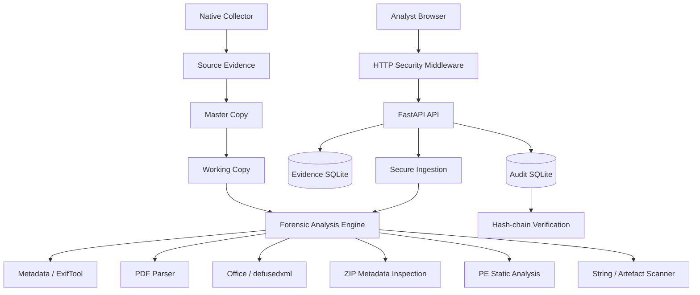
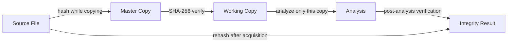
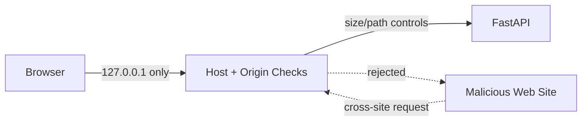
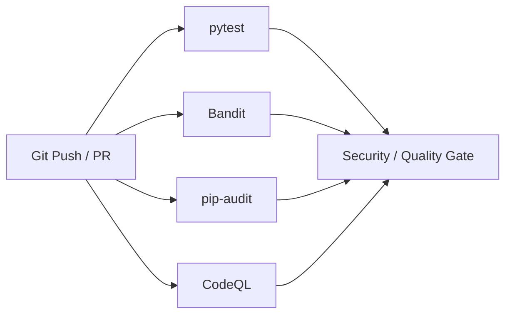

# Security Architecture Notes

This document is a shorter companion to `threat-model.md`.

## Security layers

## Evidence-preservation model

## Browser/API model

## CI security model

## Important design boundaries

The application is deliberately:

- local-only;
- static-analysis focused;
- single-analyst/workstation oriented;
- not an evidence-vault service;
- not a malware sandbox;
- not a physical imaging product.

Any future change to remote/multi-user operation invalidates several current security assumptions and must trigger a new threat-model review.
